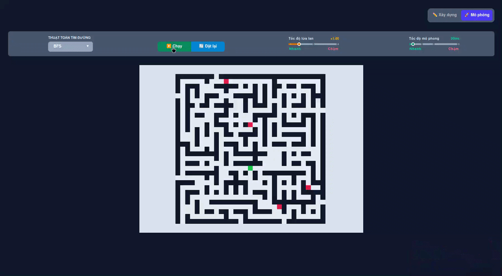

<p align="center">
  
</p>

<p align="center">
  <a href="LICENSE"></a>
  <a href="#"></a>
  <a href="https://firestar-dhc.pages.dev/"></a>
</p>

# FireStar

A maze-solving visualisation, featuring dynamic fire spread simulation and pathfinding algorithms.



## Overview

FireStar is a pathfinding visualiser that simulates navigation through a hostile, changing environment. Unlike static maze solvers, FireStar introduces a **turn-based fire spread** mechanic that forces the agent to find the most efficient path before flames consume the path ahead.  

## Features

- Interactive maze design & generation
- Real-time fire spread simulation
- A* and BFS pathfinding
- WebGL-accelerated rendering with pan & zoom
- Adjustable simulation parameters & playback controls
- Responsive and intuitive UI

## Algorithms

- **[Breadth-First Search](https://en.wikipedia.org/wiki/Breadth-first_search)**: Explores all neighbor nodes at the current depth before moving to the next depth level.  
- **[Iterative Deepening DFS](https://en.wikipedia.org/wiki/Iterative_deepening_depth-first_search)**: Combines the space-efficiency of depth-first search with the optimality of breadth-first search by gradually increasing the depth limit.  
- **[A\* Search](https://en.wikipedia.org/wiki/A*_search_algorithm)**: Uses heuristics to prioritize promising paths while considering spreading fire.  
- **[Beam Search](https://en.wikipedia.org/wiki/Beam_search)**: Optimizes memory usage by exploring only a limited number of the most promising paths at each level.
- **Cellular Automata Fire**: Fire spreads based on neighboring cells, dynamically blocking paths.

## Tech Stack

| Layer | Technology |
| :--- | :--- |
| **Framework** | React 19 |
| **UI Components** | Mantine 9 |
| **Graphics Engine** | PixiJS 8 |
| **Build Tool** | Vite 8 |
| **Package Manager** | pnpm |

## Getting Started

### Prerequisites & Dependencies

- [Node.js](https://nodejs.org/) 20+
- [pnpm](https://pnpm.io/) 9+

### 1. Clone the repository

```bash
git clone https://github.com/FairyHmm/FireStar
cd FireStar
```

### 2. Install dependencies
```bash
pnpm install
```

### 3. Launch development server

```bash
pnpm run dev
```

### 4. Build for production

```bash
pnpm run build
```

## Known Limitations

- Larger mazes may reduce performance.
- Current grids do not support variable weights.

## Future Improvements

- [ ] Implementation of more maze algorithms.
- [ ] Customisable fire spread patterns.
- [ ] Support for terrain types to create variable weights.
- [ ] Performance benchmarking suite.

## License

This project is licensed under [AGPL-3.0-only](LICENSE).
